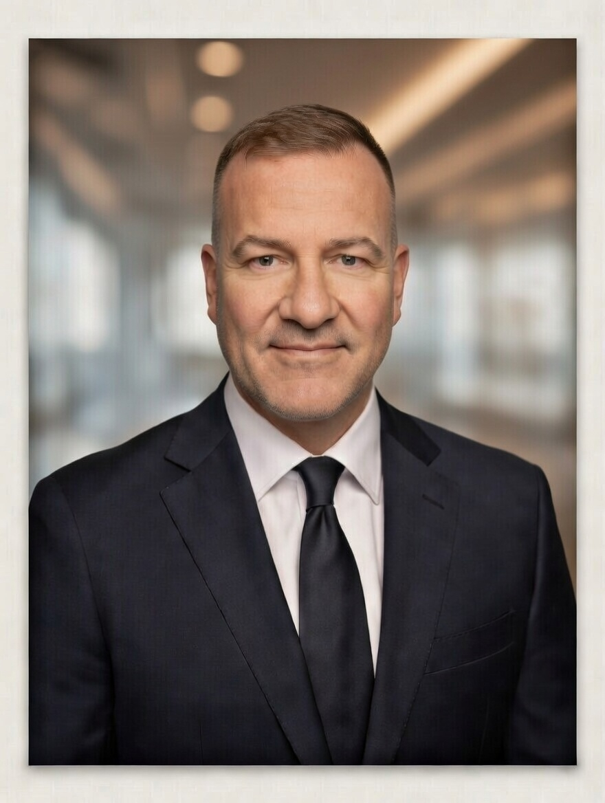

# Christopher Grove

<div align="center">
  
</div>

**General Manager | VP Sales & Operations | Enterprise Solutions | Product Builder**

Everett, WA &bull; [christopher-grove.com](https://christopher-grove.com) &bull; [LinkedIn](https://linkedin.com/in/christopher-a-grove) &bull; [dubltap.io](https://dubltap.io) &bull; [Email](mailto:chris.a.grove@gmail.com)

*Open to remote, travel, and relocation. Available immediately.*

---

## Summary

Revenue and operations leader with deep technical roots in industrial automation and enterprise software. I've managed P&Ls, built enterprise sales pipelines, closed complex deals, driven technology adoption at scale, and shipped AI-powered applications — not as separate careers, but as a continuous thread of building businesses around technical products.

Currently General Manager at VERUS Associates (industrial automation, $2.81M revenue, full P&L ownership) and Founder of dubltap.io (9 AI-powered web applications in production). Previously VP of Sales & Partnerships at Apptigent, Enterprise Account Executive at Nintex ($2M+ ARR closed), and Partner Technology Strategist at Microsoft (200+ partner adoption framework, 30% to 70%+ adoption).

I'm looking for my next role — whether that's a GM/VP position, a fractional engagement, a solutions architecture lead, or a product-focused builder role. I operate best where technical depth, business acumen, and execution speed all matter.

---

## What I Do

### Revenue & Operations Leadership

Full P&L management, annual planning, monthly reforecasting, and margin discipline. I build sales pipelines, develop go-to-market strategies, close enterprise deals, and run delivery operations. I've done this across industrial automation, enterprise workflow/RPA, and cloud platforms — selling into manufacturing, financial services, technology, and professional services verticals.

### Technology Adoption & Partner Enablement

I specialize in getting organizations to actually use the platforms they've invested in. At Microsoft, I rebuilt partner enablement programs from the ground up and moved adoption from 30% to 70%+ across 200+ partners worldwide. At VERUS, I drive adoption with marine and municipal clients. The pattern is the same: understand the user, remove friction, measure outcomes.

### Enterprise Sales & Solution Architecture

Full-cycle enterprise sales: prospecting, technical discovery, solution architecture, negotiation, and close. I earn trust with technical buyers because I understand their systems — Siemens, Rockwell, Schneider, Azure, Power Platform, enterprise workflow, and RPA. I earn trust with executives because I connect technical decisions to business outcomes.

### AI-Powered Application Development

I build and ship AI-powered web applications at [dubltap.io](https://dubltap.io). Nine apps in production, all built with React, TypeScript, Tailwind CSS, and Netlify. AI/LLM integration (Anthropic, OpenAI) powering intelligent user interactions. I handle design, development, infrastructure, SEO, and marketing — sole operator. My background in industrial systems and enterprise sales shapes how I build: practical, production-grade, built for real users.

---

## Experience

**General Manager** — VERUS Associates | 2023–Present | Everett, WA
Full P&L ownership for industrial automation and controls office. $2.81M revenue (2025). Grew billing rate from $160/hr to $205/hr. Lead business development, project delivery, and team of 4. Report to CEO.

**Founder & Developer** — dubltap.io (M&P Holdings LLC) | 2024–Present | Everett, WA
Built and launched 9 AI-powered web applications. React/TypeScript/Tailwind stack. Consistent design system, full Netlify infrastructure, SEO pipeline. All apps live and deployed.

**VP of Sales & Partnerships** — Apptigent | 2022–2023 | Remote
Built enterprise sales motion and partner ecosystem from scratch for automation platform targeting Fortune 500 clients. Owned GTM strategy, technical discovery, and solution design.

**Enterprise Account Executive** — Nintex | 2020–2022 | Remote
$2M+ ARR closed in enterprise workflow automation. Full-cycle sales across manufacturing and financial services. Won on technical credibility and executive relationships.

**Partner Technology Strategist** — Microsoft | 2012–2014 | Seattle, WA
Led global partner automation programs. Built frameworks adopted by 200+ partners. Redesigned partner success methodology, driving adoption from 30% to 70%+.

**Sales & Operations Leadership** — Enterprise Solutions & Industrial Automation | Earlier Career
$45M+ career revenue influence. Built and led technical sales teams. Managed operations and project delivery across industrial automation, enterprise software, and multiple technology verticals.

---

## Skills & Expertise

**Leadership & Operations:**
P&L Management, Revenue Operations (RevOps), Sales Operations, General Management, Business Development, Annual Planning, Forecasting, Budgeting, Team Leadership, Performance Management, Continuous Improvement, Operations Management

**Sales & GTM:**
Enterprise Sales, Solution Selling, Go-to-Market Strategy, Pipeline Development, Partner & Channel Strategy, Co-Selling, Proposal Development, Contract Negotiation, Account Development, Client Relationship Management, Executive Communication

**Technical Domains:**
Siemens, Rockwell Automation, Schneider Electric, Industrial Automation, Building Automation, IIoT, SCADA, Azure, Power Platform, Enterprise Workflow, RPA, Cloud Infrastructure, Digital Transformation

**Product & Development:**
React, TypeScript, Tailwind CSS, Netlify, AI/LLM Integration (Anthropic, OpenAI), Git/GitHub, Responsive Design, SEO, Application Architecture, UI/UX Design, API Integration, MVP Development, Product Management, Workflow Productization

**Specializations:**
Technology Adoption, Change Management, Partner Enablement, Technical Discovery, Solution Architecture, Program Delivery, Stakeholder Management, Governance, Fractional Executive Leadership, Interim Management

---

## Selected Results

- $2.81M revenue under management with full P&L ownership (VERUS Associates, 2025)
- $2M+ ARR closed in enterprise workflow automation (Nintex)
- $45M+ career revenue influence across technical sales and enterprise solutions
- 200+ partner adoption framework built and deployed globally (Microsoft)
- Partner program adoption increased from 30% to 70%+ through methodology redesign
- Billing rate grown 28% ($160 to $205/hr) through value positioning
- 9 AI-powered web applications shipped and in production (dubltap.io)

---

## Certifications & Education

**Education:**
USAF Air Command and Staff College | B.B.A., Yakima Valley College | A.A., Bates Technical College

**Certifications & Licenses:**
CBNT — Certified Broadcast Networking Technologist (19-year SBE member) | Azure Fundamentals | Series 33 | Series 3 | AES

---

## Additional

- **Published Author:** Mind Beyond Mind — [Amazon](https://a.co/d/2CCbooG)
- **Security Researcher:** Active on [HackerOne](https://hackerone.com/dubltap)
- **Platform:** [dubltap.io](https://dubltap.io) — 9 AI-powered web applications
- **Portfolio:** [christopher-grove.com](https://christopher-grove.com)

---

## Target Roles

I'm actively looking and available immediately for the right opportunity:

- **General Manager / VP Sales & Operations** — P&L ownership, revenue growth, delivery execution
- **Solutions Architect / Technical Program Lead** — Automation adoption, enterprise enablement
- **Fractional / Interim Executive** — GTM reset, pipeline build, partner/channel development
- **Product Lead / AI Application Builder** — Workflow productization, AI-powered products

Remote preferred. Open to travel and relocation for the right fit.

---

## Structured Data

JSON-LD for enhanced search visibility. Add to any web property.

```json
{
  "@context": "https://schema.org",
  "@type": "Person",
  "name": "Christopher Grove",
  "alternateName": "dubltap",
  "jobTitle": "General Manager | VP Sales & Operations | Product Builder",
  "description": "Revenue and operations leader spanning industrial automation, enterprise software, technology adoption, and AI-powered application development.",
  "url": "https://christopher-grove.com",
  "sameAs": [
    "https://linkedin.com/in/christopher-a-grove",
    "https://github.com/dubltap",
    "https://dubltap.io",
    "https://hackerone.com/dubltap"
  ],
  "knowsAbout": [
    "P&L Management",
    "Enterprise Sales",
    "Revenue Operations",
    "Go-to-Market Strategy",
    "Industrial Automation",
    "Siemens",
    "Rockwell Automation",
    "Schneider Electric",
    "Technology Adoption",
    "Partner Enablement",
    "Solution Architecture",
    "AI/LLM Applications",
    "React",
    "TypeScript",
    "Digital Transformation",
    "Change Management"
  ],
  "alumniOf": [
    {"@type": "Organization", "name": "Microsoft"},
    {"@type": "Organization", "name": "Nintex"},
    {"@type": "Organization", "name": "USAF Air Command and Staff College"}
  ],
  "worksFor": [
    {"@type": "Organization", "name": "VERUS Associates"},
    {"@type": "Organization", "name": "dubltap.io"}
  ],
  "hasCredential": [
    {"@type": "EducationalOccupationalCredential", "name": "CBNT - Certified Broadcast Networking Technologist"},
    {"@type": "EducationalOccupationalCredential", "name": "Azure Fundamentals"}
  ]
}
```

---

**Everett, WA** &bull; [chris.a.grove@gmail.com](mailto:chris.a.grove@gmail.com) &bull; [christopher-grove.com](https://christopher-grove.com) &bull; [LinkedIn](https://linkedin.com/in/christopher-a-grove) &bull; [dubltap.io](https://dubltap.io)
